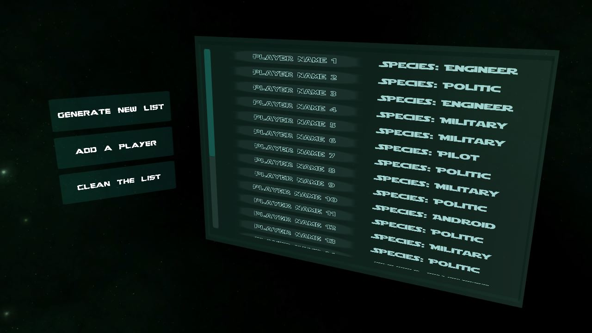
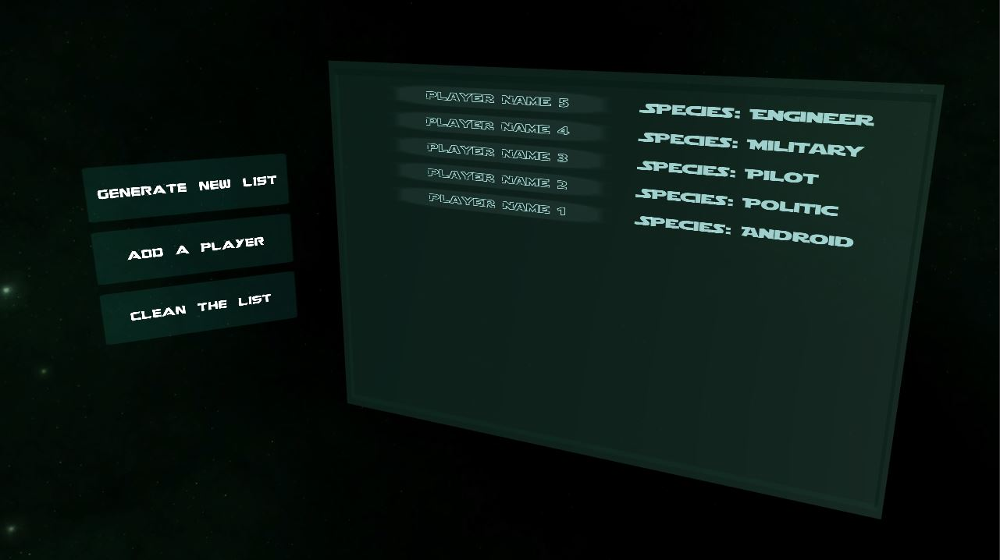
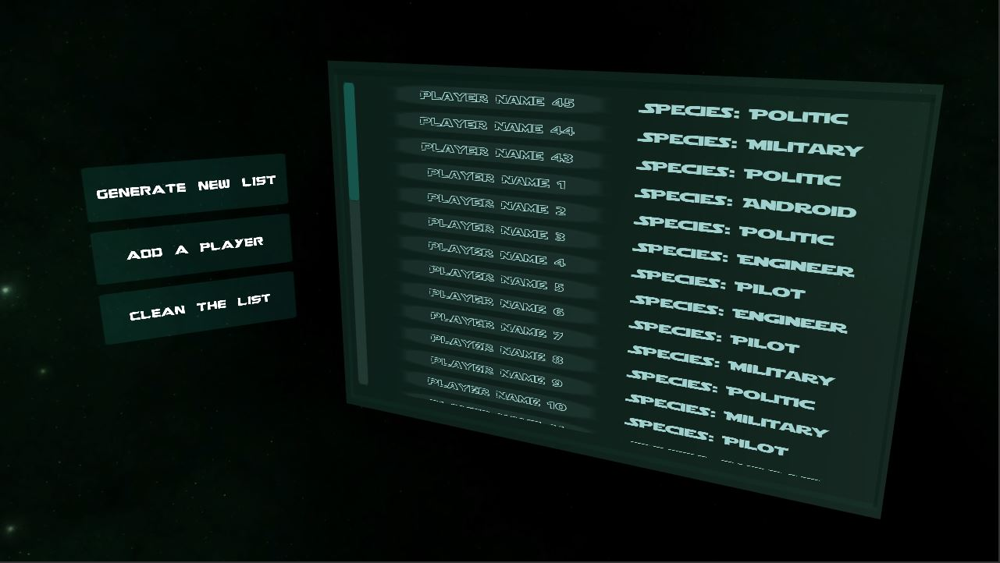

SPACE PLAYER GENERATOR

This project consists of creating an interface which includes a list of players, having a name and a class.
The number of players is random, between 20 and 50, the class of each player is also random, among the following: "Engineer", "Politic", "Pilot", "Android", "Military".
The first button allows to delete the list and generate a new (random) one, the second button to add a player on the top of the list and the third to just clean the list.

The class of the player added with the second button is semi-random:
* If there is an equal proportion of classes, the new player’s class will be random (Basics Chances 20%)
* If one class is more widespread than the others, its possibilities are recalculated with respect to the least widespread class, ex:
** - There are 10 Engineers, 10 Politics, 10 Pilots, 10 Androids, 8 Militaries
      New Chances (Engineers 15% ; Politics 15% ; Pilots 15% ; Androids 15% ; Militaries 40%)
** - There are 5 Engineers, 3 Politics, 4 Pilots, 10 Androids, 6 Militaries
      New Chances (Engineers 6,6% ; Politics 80% ; Pilots 13,3% ; Androids 0% ; Militaries 0%)

* Fonts source: [dafont.com](https://www.dafont.com/fr/)
* Skybox source: [doc.babylonjs.com](https://doc.babylonjs.com/resources/playground_textures#cubetextures)
